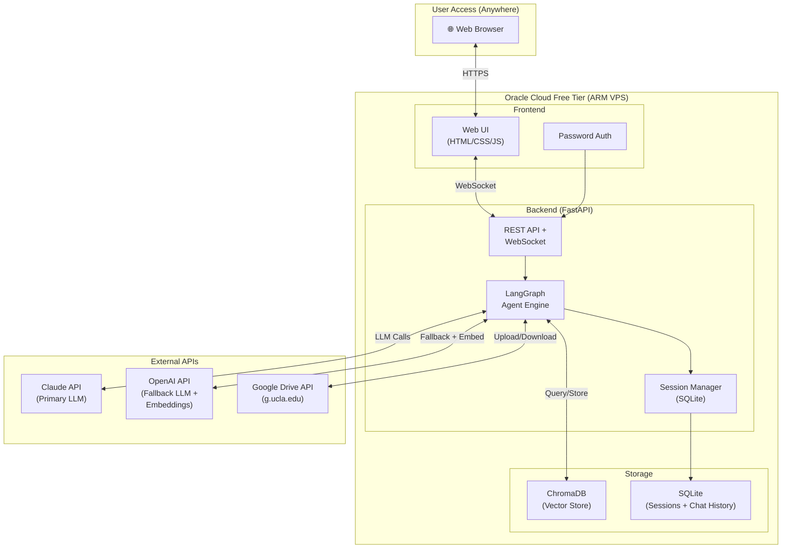
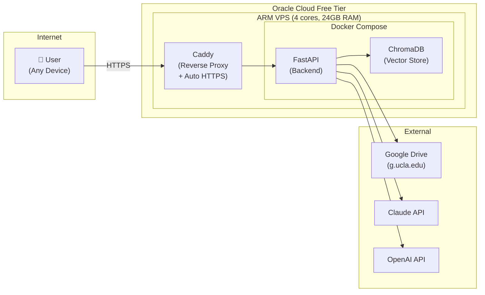

# Agentic Course RAG Pipeline — Implementation Plan

> **Last Updated**: 2026-04-25
> **Status**: Implemented

## Overview

An agentic RAG pipeline that helps you query your UCLA course materials (slides, transcripts) for deadlines, summaries, and general Q&A. Orchestrated with **LangGraph**, stored on **Google Drive (g.ucla.edu)**, embedded in **ChromaDB** with **OpenAI embeddings**, deployed on **Oracle Cloud Free Tier**, and accessed via a **premium web interface** from anywhere.

---

## Confirmed Decisions

| Decision | Choice |
|---|---|
| **Primary LLM** | Claude 3.5 Haiku (Anthropic API) |
| **Fallback LLM** | GPT-4o-mini (OpenAI API) |
| **Embeddings** | OpenAI `text-embedding-3-small` (API) |
| **Vector Store** | ChromaDB (self-hosted on VPS) |
| **File Storage** | Google Drive (g.ucla.edu) |
| **Deployment** | Oracle Cloud Always Free ARM VPS |
| **Domain** | DuckDNS free subdomain |
| **Frontend** | Web-based (HTML/CSS/JS) |
| **Auth** | Single password |
| **Conversation** | Multi-turn with session persistence |
| **Re-embedding** | Manually triggered |
| **Upload** | Drag-and-drop + Drive link, with human-in-the-loop approval |
| **Summary Feature** | Returns both file links AND download option |
| **Image Handling** | Text extraction first, Tesseract OCR fallback for scanned/image pages |

### Courses — Spring 2026

| Course Code | Full ID | Course Name |
|---|---|---|
| `MSA408` | `26S-MGMTMSA-408-LEC-2` | Operations Analytics |
| `MSA409` | `26S-MGMTMSA-409-01/02` | Competitive Analytics |
| `MSA410` | `26S-MGMTMSA-410-LEC-2` | Customer Analytics |
| `MSA413` | `26S-MGMTMSA-413-SEM-1` | Industry Seminar II |

### Cost Breakdown (Monthly)

| Item | Cost |
|---|---|
| Oracle Cloud VPS | **$0** (Always Free tier) |
| OpenAI Embeddings | ~**$0.01-0.02** per full re-embed |
| Claude API (primary LLM) | ~**$1-3** depending on usage |
| OpenAI API (fallback) | ~**$0-1** (only if Claude fails) |
| Google Drive API | **$0** |
| DuckDNS Domain | **$0** |
| **Total** | **~$1-4/month** |

---

## Architecture Overview

### System Diagram



### LangGraph Flow Diagram

```mermaid
graph TD
    START((START)) --> InputHandler["📥 Input Handler<br/><i>Parse user message,<br/>load chat history</i>"]

    InputHandler --> Router{"🔀 Router<br/><i>Classify query type</i>"}

    Router -->|"deadline"| DeadlineRetrieve["🔍 Deadline Retriever<br/><i>Search ChromaDB with<br/>deadline-focused query</i>"]
    Router -->|"summary"| SummaryRetrieve["🔍 Summary Retriever<br/><i>Search ChromaDB for<br/>topic-relevant docs</i>"]
    Router -->|"upload"| UploadHandler["📤 Upload Handler<br/><i>Receive file or<br/>Drive link</i>"]
    Router -->|"general"| GeneralRetrieve["🔍 General Retriever<br/><i>Search ChromaDB for<br/>relevant context</i>"]

    %% Deadline Branch
    DeadlineRetrieve --> DeadlineExtract["📅 Deadline Extractor<br/><i>LLM extracts date/time<br/>from retrieved chunks</i>"]
    DeadlineExtract --> DeadlineVerify{"✅ Deadline Verifier<br/><i>Re-query & cross-check<br/>extracted deadline</i>"}
    DeadlineVerify -->|"verified"| DeadlineFormat["📋 Format Response<br/><i>Date + source chunks</i>"]
    DeadlineVerify -->|"conflict"| DeadlineConflict["⚠️ Conflict Handler<br/><i>Show both results +<br/>flag uncertainty</i>"]

    %% Summary Branch
    SummaryRetrieve --> SummaryRedirect["📂 Summary Redirector<br/><i>Collect relevant file<br/>links from Drive</i>"]
    SummaryRedirect --> SummaryFormat["📋 Format Response<br/><i>File links + download<br/>options + guidance</i>"]

    %% Upload Branch
    UploadHandler --> LocationClassifier["🏷️ Location Classifier<br/><i>LLM analyzes content,<br/>proposes Drive path</i>"]
    LocationClassifier --> HumanApproval{{"👤 Human Approval<br/><i>INTERRUPT: Show proposed<br/>path, wait for confirm</i>"}}
    HumanApproval -->|"approved"| ExecuteUpload["⬆️ Execute Upload<br/><i>Upload to Drive +<br/>Embed in ChromaDB</i>"]
    HumanApproval -->|"rejected/modified"| LocationClassifier
    ExecuteUpload --> UploadFormat["📋 Format Response<br/><i>Confirmation + location</i>"]

    %% General Branch
    GeneralRetrieve --> GeneralRespond["💬 General Responder<br/><i>LLM answers with<br/>retrieved context</i>"]

    %% All converge
    DeadlineFormat --> ResponseOut["📤 Response Output<br/><i>Format + send to user,<br/>save to chat history</i>"]
    DeadlineConflict --> ResponseOut
    SummaryFormat --> ResponseOut
    UploadFormat --> ResponseOut
    GeneralRespond --> ResponseOut

    ResponseOut --> END((END))

    style HumanApproval fill:#ff9800,stroke:#e65100,color:#000
    style DeadlineVerify fill:#4caf50,stroke:#2e7d32,color:#fff
    style Router fill:#2196f3,stroke:#1565c0,color:#fff
```



---

## Detailed Node Descriptions

### 1. Input Handler
- Receives the raw user message from WebSocket
- Loads conversation history from SQLite for the active session
- Attaches chat history to the LangGraph state for context
- Detects if there's a file attachment (for upload flow)

### 2. Router Node
Uses Claude/OpenAI to classify the query into one of 4 types:

| Query Type | Trigger Examples | Route |
|---|---|---|
| `deadline` | "When is HW3 due?", "MSA408 assignment deadline" | Deadline Branch |
| `summary` | "Summarize lecture 5", "What was covered in week 3?" | Summary Branch |
| `upload` | "Upload this file", user attaches a file, provides Drive link | Upload Branch |
| `general` | "Explain regression from Operations Analytics", "What is CLV?" | General Branch |

**Classification prompt** will include examples and the conversation context so it can handle follow-ups like "When is it due?" (referring to a previously mentioned assignment).

### 3. Retriever Nodes (Deadline, Summary, General)
- Query ChromaDB with the user's question
- Apply **metadata filters** based on context:
  - If user mentions a specific course → filter by course
  - If user mentions a specific quarter → filter by quarter
  - If user mentions slides vs transcripts → filter by type
- Return top-k relevant chunks with metadata (source file, page number, course, quarter)
- **k values**: `k=5` for deadline, `k=10` for summary, `k=7` for general

### 4. Deadline Extractor
- Takes retrieved chunks and uses LLM to extract:
  - Assignment/exam name
  - Due date and time
  - Any special instructions (late policy, submission format)
- Structured output using Pydantic model

### 5. Deadline Verifier (Self-Check)
- Takes the extracted deadline and **re-queries** ChromaDB with a rephrased search
- Compares the two results:
  - **Match** → High confidence, return verified answer
  - **Conflict** → Flag uncertainty, show both results with source chunks
- Always includes the **source chunks** in the response so user can verify

### 6. Summary Redirector
- Takes retrieved document chunks
- Maps chunks back to their **original files** on Google Drive
- Generates shareable Drive links for each relevant file
- Returns a response like:
  > "For a summary of Lecture 5 on Regression Models, I found these relevant documents:
  > 1. 📄 [MSA408_Lecture5_Slides.pdf](drive-link) — Pages 12-28 cover this topic
  > 2. 📝 [MSA408_Lecture5_Transcript.txt](drive-link) — Relevant sections highlighted
  >
  > I recommend using your personal LLM to generate a detailed summary from these files to save on API costs."
- Also provides a **download button** in the UI for each file

### 7. Upload Handler
- Accepts files via two methods:
  - **Drag-and-drop**: File is uploaded to the server temporarily
  - **Drive link**: File is referenced by its Drive URL
- Extracts text content from the file for analysis

### 8. Location Classifier
- LLM analyzes the uploaded file's content and filename
- Knows the Drive folder structure and available courses
- Proposes a location in the Drive structure:
  ```
  Spring2026/MSA408:Operations_Analytics/slides/MSA408_Lecture6_Slides.pdf
  ```
- Shows reasoning for the classification

### 9. Human Approval (Interrupt)
- **LangGraph `interrupt_before`** pauses execution
- Frontend displays the proposed location to the user
- User can:
  - ✅ **Approve** → Continue to upload
  - ✏️ **Modify** → Change the path, then continue
  - ❌ **Reject** → Cancel the upload
- Uses LangGraph's **checkpointer** (SQLite) to persist state during pause

### 10. Execute Upload
- Uploads file to the approved Google Drive location
- Extracts text from the file (PyMuPDF for PDF, with Tesseract OCR fallback for scanned pages; direct read for .txt)
- Chunks the text using the chunking strategy (below)
- Embeds chunks using OpenAI `text-embedding-3-small`
- Stores embeddings + metadata in ChromaDB
- Returns confirmation with the file's Drive link

### 11. General Responder
- Uses retrieved context chunks + conversation history
- LLM generates a contextual answer
- Includes source citations in the response

### 12. Response Output
- Formats the final response with markdown
- Saves the exchange to SQLite (conversation history)
- Sends response via WebSocket to the frontend

---

## Data Model

### Google Drive Structure
```
Course_RAG_Data/
├── Spring2026/
│   ├── MSA408:Operations_Analytics/
│   │   ├── slides/
│   │   │   ├── MSA408_Lecture1_Slides.pdf
│   │   │   ├── MSA408_Lecture2_Slides.pdf
│   │   │   └── ...
│   │   └── transcripts/
│   │       ├── MSA408_Lecture1_Transcript.txt
│   │       ├── MSA408_Lecture2_Transcript.txt
│   │       └── ...
│   ├── MSA409:Competitive_Analytics/
│   │   ├── slides/
│   │   └── transcripts/
│   ├── MSA410:Customer_Analytics/
│   │   ├── slides/
│   │   └── transcripts/
│   └── MSA413:Industry_Seminar_II/
│       ├── slides/
│       └── transcripts/
├── Winter2026/
│   └── ...
└── Fall2025/
    └── ...
```

### ChromaDB Collections

**Single collection** with rich metadata for filtering:

```python
collection.add(
    ids=["chunk_001", "chunk_002", ...],
    embeddings=[[0.1, 0.2, ...], ...],
    documents=["chunk text content...", ...],
    metadatas=[{
        "quarter": "Spring2026",
        "course_id": "MSA408",
        "course_full_id": "26S-MGMTMSA-408-LEC-2",
        "course_name": "Operations_Analytics",
        "file_type": "slides",          # "slides" | "transcripts"
        "file_name": "MSA408_Lecture1_Slides.pdf",
        "drive_file_id": "1aBcDeF...",  # Google Drive file ID
        "drive_link": "https://drive.google.com/...",
        "page_number": 5,               # for PDFs
        "chunk_index": 0,               # position within file
        "total_chunks": 12,
        "contains_deadline": false,     # deadline keyword flag
        "embedded_at": "2026-04-07T10:00:00Z"
    }, ...]
)
```

### SQLite Schema (Sessions & Chat History)

```sql
-- User sessions
CREATE TABLE sessions (
    session_id TEXT PRIMARY KEY,
    created_at TIMESTAMP DEFAULT CURRENT_TIMESTAMP,
    last_active TIMESTAMP DEFAULT CURRENT_TIMESTAMP
);

-- Chat messages
CREATE TABLE messages (
    id INTEGER PRIMARY KEY AUTOINCREMENT,
    session_id TEXT REFERENCES sessions(session_id),
    role TEXT NOT NULL,         -- 'user' | 'assistant'
    content TEXT NOT NULL,
    query_type TEXT,            -- 'deadline' | 'summary' | 'upload' | 'general'
    source_chunks TEXT,         -- JSON array of source chunks
    created_at TIMESTAMP DEFAULT CURRENT_TIMESTAMP
);

-- LangGraph checkpoints (for human-in-the-loop)
-- Managed by LangGraph's SqliteSaver
```

### LangGraph State

```python
from typing import TypedDict, Optional, Literal
from langgraph.graph import MessagesState

class AgentState(MessagesState):
    """Extended state for the Course RAG agent."""
    # Query classification
    query_type: Literal["deadline", "summary", "upload", "general", "unknown"]

    # Retrieval results
    retrieved_chunks: list[dict]        # chunks from ChromaDB
    retrieval_scores: list[float]       # relevance scores

    # Deadline-specific
    extracted_deadline: Optional[dict]  # {assignment, date, time, notes}
    verification_result: Optional[dict] # {verified: bool, conflicts: list}

    # Summary-specific
    relevant_files: list[dict]          # [{name, drive_link, pages, ...}]

    # Upload-specific
    upload_file_info: Optional[dict]    # {name, content, source}
    proposed_location: Optional[str]    # e.g., "Spring2026/MSA408:.../slides/"
    human_decision: Optional[str]       # "approved" | "rejected" | modified path

    # Session
    session_id: str
    conversation_history: list[dict]
```

---

## Chunking Strategy

### For Slide PDFs
- **Method**: Page-level chunking
- **Each chunk** = content of one PDF page
- **Overlap**: Include the previous page's last 2 lines as prefix (for context continuity)
- **Metadata**: Page number, total pages, file name, course, quarter
- **Rationale**: Slides are naturally page-separated; deadlines usually appear on a single slide

### For Transcript TXT Files
- **Method**: Recursive character text splitting
- **Chunk size**: 1500 characters (~375 tokens)
- **Overlap**: 200 characters
- **Metadata**: Chunk index, character offset, file name, course, quarter
- **Rationale**: 3-hour transcripts are very long (~30,000+ words); smaller chunks allow precise retrieval while overlap preserves context

### Special Handling
- **Deadline detection enhancement**: When processing slides, if a chunk contains keywords like "due", "deadline", "submit", "assignment", tag it with `contains_deadline: true` in metadata for priority retrieval

---

## LLM Fallback Strategy

```python
async def call_llm(messages, model_preference="claude"):
    """Try Claude first, fall back to OpenAI."""
    try:
        # Try Claude (3.5 Haiku) first
        response = await anthropic_client.messages.create(
            model="claude-3-5-haiku-20241022",
            messages=messages,
            max_tokens=4096
        )
        return response, "claude"
    except Exception as claude_error:
        logger.warning(f"Claude failed: {claude_error}, falling back to OpenAI")
        try:
            # Fall back to OpenAI (GPT-4o-mini for cost efficiency)
            response = await openai_client.chat.completions.create(
                model="gpt-4o-mini",
                messages=messages,
                max_tokens=4096
            )
            return response, "openai"
        except Exception as openai_error:
            raise Exception(f"Both LLMs failed. Claude: {claude_error}, OpenAI: {openai_error}")
```

---

## Project File Structure

```
Course_RAG/
├── .env.example                      # Template for API keys
├── .env                              # Actual API keys (gitignored)
├── .gitignore
├── requirements.txt                  # Python dependencies
├── Dockerfile                        # Container for deployment
├── docker-compose.yml                # Orchestrate services
├── README.md                         # Setup & usage guide
│
├── docs/
│   └── implementation_plan.md        # This document
│
├── backend/
│   ├── __init__.py
│   ├── main.py                       # FastAPI entry point
│   ├── config.py                     # Settings (env vars, constants)
│   ├── auth.py                       # Simple password authentication
│   │
│   ├── agent/
│   │   ├── __init__.py
│   │   ├── state.py                  # AgentState TypedDict
│   │   ├── graph.py                  # LangGraph graph definition
│   │   ├── prompts.py               # All LLM prompt templates
│   │   │
│   │   └── nodes/
│   │       ├── __init__.py
│   │       ├── input_handler.py      # Parse input, load history
│   │       ├── router.py            # Query type classification
│   │       ├── retriever.py         # ChromaDB search (shared)
│   │       ├── deadline_extractor.py # Extract deadline info
│   │       ├── deadline_verifier.py  # Self-check verification
│   │       ├── summary_redirector.py # Find files, generate links
│   │       ├── upload_handler.py     # Handle file uploads
│   │       ├── location_classifier.py # Propose upload location
│   │       ├── upload_executor.py    # Execute approved upload
│   │       ├── general_responder.py  # General Q&A response
│   │       └── response_output.py    # Format & save response
│   │
│   ├── services/
│   │   ├── __init__.py
│   │   ├── llm_service.py           # Claude + OpenAI with fallback
│   │   ├── embedding_service.py     # OpenAI embedding wrapper
│   │   ├── chroma_service.py        # ChromaDB operations
│   │   ├── drive_service.py         # Google Drive API wrapper
│   │   ├── pdf_processor.py         # PDF text extraction (PyMuPDF + Tesseract OCR)
│   │   ├── text_processor.py        # Text chunking logic
│   │   └── session_service.py       # SQLite session management
│   │
│   ├── api/
│   │   ├── __init__.py
│   │   ├── routes_chat.py           # WebSocket chat endpoint
│   │   ├── routes_upload.py         # File upload endpoints
│   │   ├── routes_admin.py          # Re-embed, status endpoints
│   │   └── routes_auth.py          # Login endpoint
│   │
│   └── models/
│       ├── __init__.py
│       └── schemas.py               # Pydantic request/response models
│
├── frontend/
│   ├── index.html                    # Main SPA shell
│   ├── login.html                    # Login page
│   ├── css/
│   │   ├── variables.css             # Design tokens
│   │   ├── base.css                  # Reset & base styles
│   │   ├── components.css            # Reusable component styles
│   │   └── pages.css                 # Page-specific layouts
│   ├── js/
│   │   ├── app.js                    # Main application logic
│   │   ├── auth.js                   # Authentication handling
│   │   ├── chat.js                   # Chat interface logic
│   │   ├── upload.js                 # File upload handling
│   │   ├── websocket.js             # WebSocket connection
│   │   └── utils.js                  # Utility functions
│   └── assets/
│       └── icons/                    # SVG icons
│
├── scripts/
│   ├── setup_drive.py               # Interactive Drive setup helper
│   ├── initial_embed.py             # First-time embedding of all docs
│   ├── setup_oracle.sh              # Oracle Cloud VPS setup script
│   └── deploy.sh                    # Deployment script
│
├── credentials/
│   └── .gitkeep                     # Google OAuth credentials go here
│
└── data/
    ├── chroma_db/                    # ChromaDB persistent storage
    └── sessions.db                   # SQLite database
```

---

## Technology Stack Summary

| Component | Technology | Cost |
|---|---|---|
| **LLM (Primary)** | Claude 3.5 Haiku (Anthropic API) | ~$1-3/mo |
| **LLM (Fallback)** | GPT-4o-mini (OpenAI API) | ~$0-1/mo |
| **Embeddings** | OpenAI `text-embedding-3-small` | ~$0.02/mo |
| **Vector Store** | ChromaDB (self-hosted on VPS) | $0 |
| **File Storage** | Google Drive (g.ucla.edu) | $0 |
| **Backend Framework** | FastAPI + Uvicorn | $0 |
| **Agent Orchestration** | LangGraph | $0 |
| **PDF Processing** | PyMuPDF (fitz) | $0 |
| **OCR** | Tesseract (via PyMuPDF built-in integration) | $0 |
| **Session Storage** | SQLite | $0 |
| **Frontend** | Vanilla HTML/CSS/JS | $0 |
| **Deployment** | Oracle Cloud Free Tier (ARM) | $0 |
| **HTTPS** | Let's Encrypt + Caddy | $0 |
| **Containerization** | Docker + Docker Compose | $0 |
| **Domain** | DuckDNS free subdomain | $0 |

---

## Deployment Architecture (Oracle Cloud)



### Oracle Cloud Setup Steps

1. **Create Account**: Sign up at [cloud.oracle.com](https://cloud.oracle.com) — requires credit card for identity verification (not charged for Always Free resources)
2. **Create Compute Instance**:
   - Shape: `VM.Standard.A1.Flex` (ARM)
   - OCPUs: 4, RAM: 24 GB
   - OS: Ubuntu 22.04 (aarch64)
   - Boot volume: 100 GB
3. **Configure Networking**:
   - Open ports 80 (HTTP) and 443 (HTTPS) in security list
   - Assign a public IP
4. **Setup Domain**:
   - Sign up at DuckDNS (free) and create a subdomain
   - Point it to the VPS public IP
5. **Install Docker**: Via automated setup script
6. **Deploy**: `docker-compose up -d`
7. **HTTPS**: Caddy handles automatic Let's Encrypt certificates

### Google Drive API Setup Steps

1. Go to [console.cloud.google.com](https://console.cloud.google.com) with g.ucla.edu account
2. Create a new project (e.g., "Course-RAG")
3. Enable the **Google Drive API**
4. Go to **Credentials** → Create **OAuth 2.0 Client ID**
5. Configure the **OAuth consent screen** (Internal if possible, External if required)
6. Download the credentials JSON → save to `credentials/` folder
7. Run `scripts/setup_drive.py` to complete OAuth flow and get refresh token

---

## Phased Implementation Plan

### Phase 1: Foundation (Day 1-2)
- [ ] Set up project structure and dependencies
- [ ] Create `.env` configuration
- [ ] Implement `config.py` with all settings (courses, quarters, etc.)
- [ ] Implement `llm_service.py` (Claude + OpenAI fallback)
- [ ] Implement `embedding_service.py` (OpenAI embeddings)
- [ ] Implement `chroma_service.py` (ChromaDB operations)
- [ ] Implement `pdf_processor.py` and `text_processor.py`
- [ ] Write basic tests for each service

### Phase 2: Google Drive Integration (Day 2-3)
- [ ] Set up Google Cloud project + Drive API
- [ ] Implement `drive_service.py`
  - List files/folders
  - Download files
  - Upload files
  - Create folders
  - Generate shareable links
- [ ] Create `setup_drive.py` interactive setup script
- [ ] Test Drive integration with UCLA account

### Phase 3: LangGraph Agent (Day 3-5)
- [ ] Define `AgentState` in `state.py`
- [ ] Implement all nodes:
  - `input_handler.py`
  - `router.py` (with classification prompt)
  - `retriever.py` (ChromaDB search with metadata filtering)
  - `deadline_extractor.py`
  - `deadline_verifier.py` (self-check logic)
  - `summary_redirector.py`
  - `upload_handler.py`
  - `location_classifier.py`
  - `upload_executor.py`
  - `general_responder.py`
  - `response_output.py`
- [ ] Define graph edges and conditional routing in `graph.py`
- [ ] Implement human-in-the-loop interrupt for upload approval
- [ ] Write `prompts.py` with all prompt templates
- [ ] Test each branch end-to-end

### Phase 4: Backend API (Day 5-6)
- [ ] Implement FastAPI app in `main.py`
- [ ] Implement `auth.py` (password authentication)
- [ ] Implement WebSocket endpoint for chat (`routes_chat.py`)
- [ ] Implement file upload endpoint (`routes_upload.py`)
- [ ] Implement admin endpoints (`routes_admin.py`)
  - Manual re-embedding trigger
  - System status
- [ ] Implement `session_service.py` for conversation persistence
- [ ] Test API endpoints

### Phase 5: Frontend (Day 6-8)
- [ ] Design and implement login page (`login.html`)
- [ ] Design and implement main chat interface (`index.html`)
  - Chat message area with markdown rendering
  - Message input with send button
  - File drag-and-drop zone
  - Drive link input option
  - Upload approval dialog (for human-in-the-loop)
  - Source chunk display (expandable)
  - File download buttons
- [ ] Implement CSS design system (`variables.css`, `base.css`, `components.css`)
- [ ] Implement JavaScript modules (`chat.js`, `upload.js`, `websocket.js`, `auth.js`)
- [ ] Add admin panel for re-embedding
- [ ] Test UI interactions

### Phase 6: Initial Data Load (Day 8)
- [ ] Organize existing course files on Google Drive in the required structure
- [ ] Run `initial_embed.py` to process and embed all documents
- [ ] Verify ChromaDB contains correct data with metadata

### Phase 7: Containerization (Day 8-9)
- [ ] Write `Dockerfile`
- [ ] Write `docker-compose.yml`
- [ ] Test Docker build and run locally
- [ ] Optimize image size for ARM deployment

### Phase 8: Oracle Cloud Deployment (Day 9-10)
- [ ] Create Oracle Cloud account and VPS
- [ ] Run `setup_oracle.sh` (Docker, Caddy, firewall)
- [ ] Set up DuckDNS domain
- [ ] Deploy with `docker-compose up -d`
- [ ] Configure Caddy for HTTPS
- [ ] End-to-end testing from external device
- [ ] Write deployment documentation

---

## Verification Plan

### Automated Tests
- Unit tests for each service (LLM, embedding, ChromaDB, Drive, PDF processing)
- Integration tests for each LangGraph branch (deadline, summary, upload, general)
- End-to-end test: Query → Retrieve → Respond pipeline
- Upload flow test with mock human approval

### Manual Verification
- Test deadline queries with actual course slides
- Test summary redirection with actual transcripts
- Test file upload with drag-and-drop and Drive link
- Test from mobile device over internet
- Test password authentication
- Test multi-turn conversation continuity
- Test LLM fallback (temporarily invalidate Claude key)
- Test re-embedding trigger from admin panel
